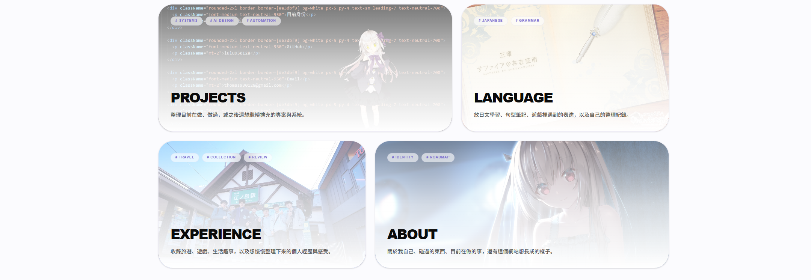

# LULULAB

LULULAB 是 Lulu星的個人網站，用來整理軟體專案、語言學習、旅遊與遊戲紀錄，以及 Wine Atlas 等生活收藏。網站以 Next.js App Router 建置，內容與圖片都直接維護在這個 repo，適合當成作品入口，也方便持續累積個人紀錄。

[瀏覽線上網站](https://lululab-site.vercel.app/) · [查看原始碼](https://github.com/lulu930128/lululab-site)



> 專案目前仍在持續整理。首頁、主要分類頁與 Wine Atlas 已可瀏覽；部分專案與遊記明細路由尚未納入目前版本。

## 網站內容

| 區域 | 路徑 | 內容 |
| --- | --- | --- |
| 首頁 | `/` | 個人簡介、精選展示、近期規劃、分類入口與生活收藏 |
| Projects | `/projects` | AI 桌寵、資安平台、自動化系統與其他開發紀錄 |
| Language | `/language` | 日文 N3、遊戲表達與技術英文筆記 |
| Experience | `/experience` | 旅遊、Galgame 與一般遊戲紀錄 |
| Wine Atlas | `/lifestyle/cellar/wine-atlas` | 酒款統計、國家探索地圖、推薦清單與近期品飲 |
| About | `/about` | 個人背景、工作經歷、學習方向與興趣 |

Projects 與 Experience 以卡片和互動視窗整理內容。資料檔裡已預留部分明細路徑，但對應頁面尚未全部完成。

## 技術組成

| 類別 | 使用技術 |
| --- | --- |
| Web framework | Next.js 16.2.3（App Router） |
| UI | React 19.2.4、TypeScript、Tailwind CSS 4 |
| Motion | Framer Motion |
| Map | D3 Geo |
| Visual details | RoughJS |
| Deployment | Vercel |

## 本機開發

### 環境需求

- Node.js `>= 20.9.0`
- npm（repo 內已包含 `package-lock.json`）
- Python 3.10+ 與 Tkinter（只有維護 Wine Atlas 本機資料時需要）

### 快速開始

```bash
git clone https://github.com/lulu930128/lululab-site.git
cd lululab-site
npm install
npm run dev
```

開啟 [http://localhost:3000](http://localhost:3000)。若 `3000` 已被其他程式占用，Next.js 會提示可用的替代 port。

目前沒有必填環境變數；`.env*` 已列入 `.gitignore`。

## 常用指令

| 指令 | 用途 |
| --- | --- |
| `npm run dev` | 啟動 Next.js 本機開發站 |
| `npm run lint` | 執行 ESLint |
| `npm run build` | 建立 production build |
| `npm run start` | 啟動已完成建置的 production server |

## 專案結構

```text
lululab-site/
├─ app/                         # App Router 頁面、區段元件與內容資料
│  ├─ projects/                # 專案列表與展示元件
│  ├─ experience/              # 旅遊與遊戲紀錄
│  ├─ language/                # 語言學習頁
│  └─ lifestyle/cellar/        # Wine Atlas 頁面
├─ components/wine-atlas/      # Wine Atlas 地圖、卡片與統計元件
├─ public/
│  ├─ images/                  # 網站靜態圖片
│  └─ wine-atlas/              # 對網站公開的酒款 JSON 與 GeoJSON
├─ tools/wine-atlas/           # SQLite schema、桌面管理工具與匯出腳本
├─ types/                      # 共用 TypeScript 型別
└─ package.json                # npm scripts 與依賴
```

## 內容維護

大部分網站內容直接由 TypeScript 資料檔與 `public` 靜態資源驅動：

| 要修改的內容 | 主要位置 |
| --- | --- |
| 首頁分類、近期規劃與生活收藏 | `app/data.ts` |
| Projects 卡片與專案資料 | `app/projects/data.ts` |
| Experience 旅遊與遊戲資料 | `app/experience/data.ts` |
| Language 筆記內容 | `app/language/page.tsx` |
| 網站圖片 | `public/images/` |
| Wine Atlas 公開資料 | `public/wine-atlas/wine-data.json` |
| Wine Atlas 世界地圖 | `public/wine-atlas/world-countries-lite.geojson` |

新增或更換圖片後，請同步確認資料檔裡的路徑與檔名大小寫。Vercel 部署環境會區分大小寫，本機 Windows 能載入的路徑不一定會在 production 正常工作。

### Wine Atlas 資料流程

Wine Atlas 採用 local-first 的維護方式：SQLite 資料庫只留在本機，網站只讀取匯出的公開 JSON。

```text
本機 SQLite → Wine Atlas Manager / export script → public JSON → Next.js 頁面
```

```bash
# 第一次使用時建立本機資料庫
python tools/wine-atlas/init_db.py

# 開啟 Tkinter 桌面管理工具
python tools/wine-atlas/app.py

# 手動重新產生網站使用的公開 JSON
python tools/wine-atlas/export_public_json.py
```

本機資料庫位於 `tools/wine-atlas/data/`，已由 `.gitignore` 排除。匯出前仍應檢查 `public/wine-atlas/wine-data.json`，因為 `public/` 下的資料會隨網站一起公開。

## 驗證

一般內容或 UI 修改完成後，至少執行：

```bash
npm run lint
npm run build
```

涉及互動與版面時，還要在瀏覽器檢查首頁、修改到的分類頁，以及窄螢幕排版。目前 repo 沒有獨立的自動化測試指令，`lint`、production build 與實際頁面檢查是主要驗證方式。

## 部署

線上版本部署於 Vercel：<https://lululab-site.vercel.app/>

部署前請確認：

- `npm run lint` 與 `npm run build` 完成
- 新增圖片與 JSON 已納入 Git，且沒有私人內容
- 站內連結與路由在 production build 中可正常開啟
- Vercel Preview 與窄螢幕版面沒有明顯錯位

專案使用 `next/font/google` 載入 Geist。完全無法連線到 Google Fonts 的受限環境可能無法完成 build，這不等同於程式碼本身失敗。

## 目前限制

- AI 桌寵、機台日報自動化、資安平台與旅遊明細頁仍在整理，部分資料中預留的連結目前沒有對應路由。
- Wine Atlas 的 SQLite 管理資料只存在維護者本機；clone repo 後拿到的是已匯出的公開 JSON。
- 專案尚未設定獨立的 unit test 或 end-to-end test script。
- repo 目前沒有 `LICENSE`。若要開放他人重用程式碼或內容，應先補上明確授權條款。
